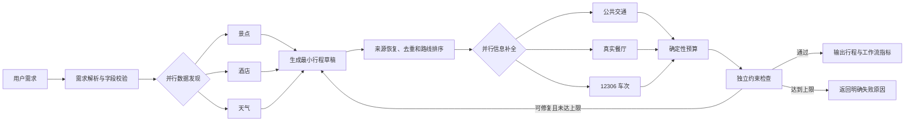

# 智能旅行助手

一个面向真实旅行规划场景的有状态智能体应用。用户可以用自然语言描述出发地、目的地、日期、人数、预算与偏好，系统会调用真实数据源生成逐日行程、公共交通建议、餐厅、酒店、天气、预算和 12306 车次信息。

项目重点解决普通大模型旅行规划中的三个问题：事实容易编造、复杂任务缺少可控流程、结果质量无法量化。系统通过来源 ID 绑定、确定性约束检查、有限重新规划和固定评测集建立可信边界。

- 在线演示：[travel-agent-production-fbc9.up.railway.app](https://travel-agent-production-fbc9.up.railway.app/#/)
- 部署说明：[Railway 当前部署与其他平台部署步骤](部署说明.md)
- 架构说明：[有状态智能体架构](docs/ARCHITECTURE.md)
- 评测依据：[智能体基准测试报告](docs/BENCHMARK.md)
- 原始评测结果：[evals/results/latest.json](evals/results/latest.json)

## 核心能力

- **自然语言需求解析**：识别出发地、目的地、出返程日期、人数、预算和旅行偏好；信息不足时返回需要补充的字段，不擅自填入默认值。
- **显式有状态工作流**：以强类型 `TravelState` 串联数据发现、草稿生成、确定性准备、信息补全、约束检查和有限重新规划。
- **独立工具节点**：景点、酒店、天气、路线、餐厅、12306、预算、约束和图片分别封装为 Node，并统一返回 `ToolResult`。
- **并行工具调用**：景点、酒店和天气并行查询；路线、餐厅和车次并行补全，降低串行等待时间。
- **完整故障策略**：支持节点级超时、分类错误、有限重试、明确降级和最大循环次数，避免无限调用。
- **来源 ID 约束**：大模型只选择真实候选 ID；景点名称、坐标、营业时间、价格等事实由后端从数据源恢复。
- **确定性约束检查**：检查未知景点、重复景区、空白行程日、营业时间、路线距离、时间负载、预算一致性、明确预算上限和禁止地点。
- **可观测性**：每次规划记录请求追踪 ID、节点状态、开始时间、耗时、尝试次数、降级情况、Token 用量和可选费用估算。
- **历史与导出**：前端保存本地历史计划，可重新查看并下载旅行攻略。
- **MCP 解耦示例**：使用 MCP Python SDK v2 对外提供真实 POI 和天气工具，核心链路仍直接复用本地节点。

## 系统工作流



更详细的节点职责、状态结构、并行边界和失败策略见[架构说明](docs/ARCHITECTURE.md)。

## 数据可信边界

| 数据或决策 | 来源与处理方式 |
|---|---|
| 景点、酒店、餐厅 | 高德 POI；通过来源 ID 绑定 |
| 天气 | 高德天气；扩展天气由 Open-Meteo 补充 |
| 火车车次与可用票价 | 12306 公开接口 |
| 景点门票 | 百度百科词条卡片；无法确认时明确标记未知 |
| 公共交通路线 | 高德公共交通路线；失败时提供带标记的确定性建议 |
| 地点图片 | 高德 POI 图片，缺失时使用 Pexels 或 Openverse |
| 酒店价格 | 免费接口无实时房价，按城市、档次和评分估算并明确标注 |
| 行程草稿 | 大模型仅选择候选景点 ID 和排列顺序 |
| 预算、重复、距离、日期和硬约束 | Python 确定性计算与检查 |
| 语义偏好覆盖 | 可选的大模型检查，不参与事实判定 |

系统禁止大模型直接生成能够从真实数据源取得的事实。未知来源 ID 会被拒绝，约束失败只允许在配置次数内重新规划。

## 实测结果

2026-09-27 对 Railway 部署版本依次运行 12 个固定案例，结果如下：

| 指标 | 实测结果 |
|---|---:|
| 固定案例通过情况 | 12/12 均通过已实现的约束检查 |
| 景点来源 ID 关联情况 | 所选景点均能关联真实候选来源 ID |
| 已实现约束检查 | 12/12 均通过 |
| 已完成案例中的工具调用 | 全部成功 |
| 重复率 | 0% |
| 未关联来源的景点占比 | 0% |
| P50 / P95 延迟 | 34.88 秒 / 42.06 秒 |
| 大模型调用次数 | 24 |
| Token 总数 | 54,224 |
| 费用 | 未配置模型单价，因此不提供估算值 |

这些数字来自真实数据源与真实大模型调用，不是测试桩结果。“未关联来源的景点占比”只检查计划中的景点是否能映射到候选来源 ID，不能解释为整段回答的幻觉率。12 个固定案例也不代表所有输入分布下都能成功。完整指标定义、适用范围和复现方法见[基准测试报告](docs/BENCHMARK.md)。

## 技术栈

- 后端：Python、FastAPI、Pydantic、LangChain、httpx
- 智能体：强类型状态、显式节点工作流、条件路由、并行执行、有限重新规划
- 工具协议：MCP Python SDK v2
- 前端：Vue 3、TypeScript、Vite、Ant Design Vue
- 数据源：高德、12306、百度百科、Open-Meteo、Pexels、Openverse
- 工程化：pytest、Docker、Docker Compose、GitHub Actions、Railway

## 项目结构

```text
travel-agent/
├── backend/
│   ├── agents/          # 景点、天气、酒店和规划智能体
│   ├── workflow/        # 状态、节点、工作流引擎和约束检查器
│   ├── tools/           # 高德、12306、门票、餐厅、天气和图片工具
│   ├── mcp_tools/       # MCP Server 与 Client Adapter
│   ├── models/          # 请求、行程、工具结果和工作流指标模型
│   └── api/             # FastAPI 接口与前端静态托管
├── frontend/            # Vue 3 前端
├── tests/               # 单元、集成和接口测试
├── evals/               # 固定评测数据集、运行器与真实结果
├── docs/                # 架构说明和基准测试报告
├── Dockerfile
├── docker-compose.yml
├── requirements.txt     # 生产运行依赖
└── requirements-dev.txt # 生产依赖 + 测试依赖
```

## 本地运行

项目要求 Python 3.11+ 和 Node.js 20+。

1. 创建 Python 环境并安装依赖：

```powershell
python -m venv .venv
.\.venv\Scripts\Activate.ps1
pip install -r requirements-dev.txt
```

2. 复制环境变量模板并填写密钥：

```powershell
Copy-Item .env.example .env
```

最少需要配置：

```ini
LLM_API_KEY=你的大模型密钥
LLM_BASE_URL=https://api.deepseek.com
LLM_MODEL=deepseek-chat
AMAP_API_KEY=你的高德Web服务Key
```

完整配置见 [.env.example](.env.example)。`.env` 已被 Git 忽略，不应提交密钥。

3. 构建前端：

```powershell
Set-Location frontend
npm ci
npm run build
Set-Location ..
```

4. 启动服务：

```powershell
python -m backend.run --port 8001
```

浏览器访问 `http://127.0.0.1:8001`。

## Docker 运行

```powershell
docker compose up --build
```

浏览器访问 `http://127.0.0.1:8000`，健康检查地址为 `http://127.0.0.1:8000/health`。

## 接口

| 方法 | 路径 | 用途 |
|---|---|---|
| `GET` | `/health` | 服务健康检查 |
| `POST` | `/api/trip-plan` | 使用结构化字段同步生成行程 |
| `POST` | `/api/trip-plan/from-text` | 从自然语言解析需求并同步生成行程 |
| `POST` | `/api/trip-plan/jobs` | 创建后台行程生成任务 |
| `GET` | `/api/trip-plan/jobs/{job_id}` | 查询后台任务状态与结果 |

自然语言请求示例：

```json
{
  "query": "十月一日到十月四日，一个人从上海去南京，预算3000元，喜欢历史文化和美食"
}
```

缺少目的地、出发地、日期、人数、预算或偏好时，接口会返回需要补充的字段；日期选择器提供的结构化日期也可以参与需求解析。

## MCP 工具服务

启动标准输入输出模式的 MCP Server：

```powershell
python -m backend.mcp_tools.server
```

当前开放 `search_pois` 和 `weather_forecast` 两个只读工具，用于展示工具与智能体的协议化解耦。MCP 不是主工作流的额外网络跳转，因此不会为了展示技术而增加线上规划延迟。

## 测试与评测

运行自动化测试：

```powershell
python -m pytest -q
```

当前结果为 93 项测试全部通过，覆盖模型校验、来源恢复、约束检查、重试、超时、降级、工作流编排、API、MCP 与评测指标汇总。

对正在运行的服务执行真实评测：

```powershell
python evals/run_evaluation.py --base-url http://127.0.0.1:8001
```

评测会真实调用大模型和外部数据源，可能产生费用。结果写入 `evals/results/latest.json`，不得使用测试桩结果冒充线上指标。

## 部署与持续集成

Docker 镜像同时构建 Vue 前端和 FastAPI 后端。GitHub Actions 在每次推送和合并请求时执行：

1. Python 编译检查与 pytest；
2. Vue TypeScript 检查与生产构建；
3. Docker 镜像构建。

Railway 绑定 `main` 分支后自动部署通过检查的版本。当前线上配置以及迁移到 Cloudflare Pages、Vercel 等平台的步骤见[部署说明](部署说明.md)。

## 已知限制

- 高德天气的多天预报范围有限，超出范围的日期会明确显示暂无预报。
- 免费数据源无法提供酒店实时房价，当前价格仅为带来源说明的估算值。
- 12306 结果受预售期、余票和接口可用性影响，最终信息应以下单页面为准。
- 浏览器历史计划保存在本地存储中，不支持账号间同步。
- 当前工作流是面向旅行领域的显式多智能体协作，不是允许智能体任意选择所有工具的通用自治系统。

## 简历描述参考

> 基于 FastAPI、LangChain、Pydantic 与 Vue 3 构建有状态旅行规划智能体，以强类型 TravelState 和显式节点工作流编排真实数据工具；实现并行工具调用、统一错误与追踪、有限重试/超时/降级/重新规划，并通过来源 ID 恢复事实字段和确定性约束检查器减少无来源景点与行程冲突。在 12 个固定端到端案例中全部通过已实现的约束检查，所选景点均能关联真实候选来源 ID。
