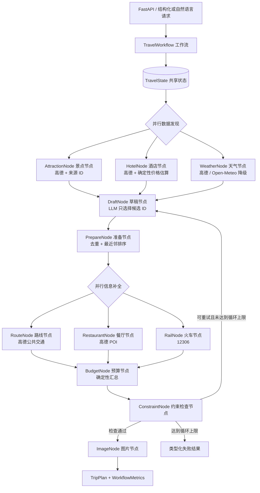

# 有状态智能体架构

系统采用渐进式方式封装已有智能体与数据源。`TripPlannerAgent.plan_trip()` 继续作为对外应用接口，`TravelWorkflow` 负责工作流编排，`TravelState` 是节点之间传递的唯一共享状态。



## 可信边界

- 大模型可以抽取用户意图、选择候选来源 ID、排列候选顺序，并判断语义偏好是否得到覆盖。
- 名称、坐标、营业时间、天气、车次、餐厅 POI 和公共交通路线等事实均由真实数据源恢复。
- 预算计算、重复检测、日期覆盖、路线距离、时间负载、闭馆规则和明确禁止地点均由 Python 确定性检查。
- 未知来源 ID 不会进入最终计划。约束失败信息只会触发有限次数的重新规划，工作流不会无限循环。

## 节点契约

所有节点均通过 `NodeRunner` 返回统一的 `ToolResult[T]`。结果结构包含状态、类型化错误、尝试次数、降级情况、延迟和来源 ID。重试与超时策略统一应用在节点边界，每个结果还会生成与请求追踪 ID 关联的 `TraceSpan`。

数据发现与信息补全分别使用独立线程池。每个并行节点接收 `TravelState` 的深拷贝，因此无法直接修改其他节点的状态；工作流引擎会在并行屏障之后合并类型化结果补丁。

## MCP 解耦边界

`backend/mcp_tools/server.py` 通过官方 MCP Python SDK v2 暴露两个已有的真实数据能力：`search_pois` 和 `weather_forecast`。`TravelMcpClient` 会把远程调用结果重新转换为统一的 `ToolResult`，供外部智能体使用。

生产工作流默认直接调用进程内节点，避免增加不必要的网络开销。MCP 在这里是可选的工具解耦边界，并未为了展示 MCP 而重写所有现有工具。

运行标准输入输出模式的 MCP Server：

```bash
python -m backend.mcp_tools.server
```

## 故障处理策略

天气、酒店、路线、餐厅、车次和图片节点在降级结果仍有意义时提供明确的确定性或空结果兜底。景点发现、计划物化、预算计算与约束检查采用失败关闭策略。

数据源鉴权错误和非法返回结果不会重试；临时数据源故障、频率限制和超时会在配置的次数范围内重试。所有重试、降级和耗时都会进入工作流指标与追踪记录。

