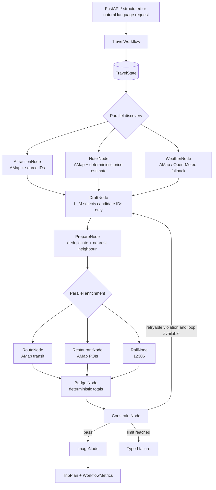

# Stateful Agent Architecture

The system incrementally wraps the existing agents and data providers. `TripPlannerAgent.plan_trip()` remains the public application interface; `TravelWorkflow` owns orchestration and `TravelState` is the only state passed between nodes.



## Trust boundary

- The LLM may extract user intent, select candidate source IDs, order candidates and judge semantic preference coverage.
- Provider facts such as names, coordinates, opening hours, weather, train options, restaurant POIs and transit routes are restored from real providers.
- Budget arithmetic, duplicate detection, date coverage, route distance, time load, opening-day rules and explicit forbidden-place constraints are deterministic Python checks.
- Unknown source IDs never enter the final plan. A bounded replan receives violation messages; the workflow never loops indefinitely.

## Node contract

Every node returns `ToolResult[T]` through `NodeRunner`. The envelope contains status, typed error, attempts, fallback use, latency and source IDs. Retry and timeout policies are applied at the node seam. Every result also produces a `TraceSpan` tied to the request trace ID.

Discovery and enrichment use independent thread pools. A node receives a deep copy of `TravelState`, so parallel nodes cannot mutate shared state. The engine merges typed patches after every parallel barrier.

## MCP boundary

`backend/mcp_tools/server.py` exposes two existing grounded capabilities through the official MCP Python SDK v2: `search_pois` and `weather_forecast`. `TravelMcpClient` maps remote calls back to `ToolResult`, so an external agent can consume the same contract. The production workflow uses the in-process nodes by default; MCP is an optional integration boundary rather than a rewrite of all tools.

Run the stdio server with:

```bash
python -m backend.mcp_tools.server
```

## Failure policy

Weather, hotel, route, restaurant, rail and image nodes have explicit deterministic or empty fallbacks where a degraded result is meaningful. Attraction discovery, plan materialization, budget and constraint checking fail closed. Provider authentication and invalid result errors are not retried; transient provider, rate-limit and timeout errors are retried up to the configured limit.

